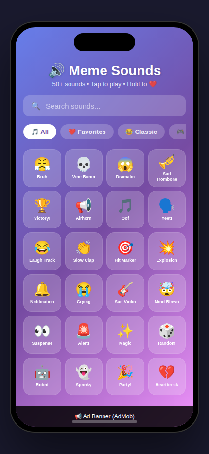

# 🔊 Meme Soundboard

> Tap to play viral meme sounds! Perfect for pranks, reactions, and fun.


## 📱 Screenshots

<p align="center">
  
</p>

## 🎯 Features

- 🔊 **50+ Viral Sounds** - All the classic memes (Bruh, Vine Boom, Oof, etc.)
- ⚡ **Instant Play** - Tap and it plays immediately
- 🔍 **Search** - Find sounds fast with real-time filtering
- ❤️ **Favorites** - Long-press to save your go-to sounds
- 🏷️ **Categories** - Browse by Classic, Gaming, TV/Movies, Music, Reactions
- 📱 **Compact Grid** - 4-column layout with all sounds visible
- 🎨 **Modern UI** - Beautiful gradient design with glassmorphism effects

## 💰 Monetization

**100% Ad-supported (Free app)**
- Banner ad at bottom
- Interstitial every 10 sound plays
- Rewarded video to unlock "Premium Sounds" pack

**Why this works:**
- High engagement = lots of ad impressions
- Viral sharing potential
- Zero friction (no paywall)

## 🔊 Sound Categories

| Category | Examples |
|----------|----------|
| 😂 **Classic Memes** | Bruh, Oof, Vine boom, Yeet |
| 🎮 **Gaming** | Victory, defeat, hit marker, level up |
| 📺 **TV/Movies** | Iconic quotes, dramatic effects |
| 🎵 **Music** | Airhorns, sad violin, sad trombone |
| 🗣️ **Reactions** | Wow, nope, laugh track |

## 🛠️ Tech Stack

- **Framework:** React Native + Expo
- **Audio:** expo-av
- **Ads:** Google AdMob (expo-ads-admob)
- **State:** Zustand (persistent favorites)
- **UI:** Linear gradients, blur effects

## 🚀 Getting Started

```bash
# Install dependencies
npm install

# Start development server
npx expo start

# Run on iOS simulator
npx expo run:ios

# Run on Android emulator
npx expo run:android
```

## 📁 Project Structure

```
meme-soundboard/
├── src/
│   ├── app/           # Main screens
│   ├── components/    # Reusable UI components
│   │   ├── SoundButton.tsx
│   │   ├── CategoryTabs.tsx
│   │   └── SearchBar.tsx
│   ├── constants/     # Sound data & config
│   └── store/         # Zustand state management
├── assets/            # Images & sounds
└── screenshots/       # App screenshots
```

## 🎨 Design

- **Gradient:** Purple to pink (#667eea → #764ba2 → #f093fb)
- **Cards:** Frosted glass effect (rgba + blur)
- **Typography:** System font, bold weights
- **Icons:** Native emoji for universal support

## 📄 License

MIT © bendudebot
